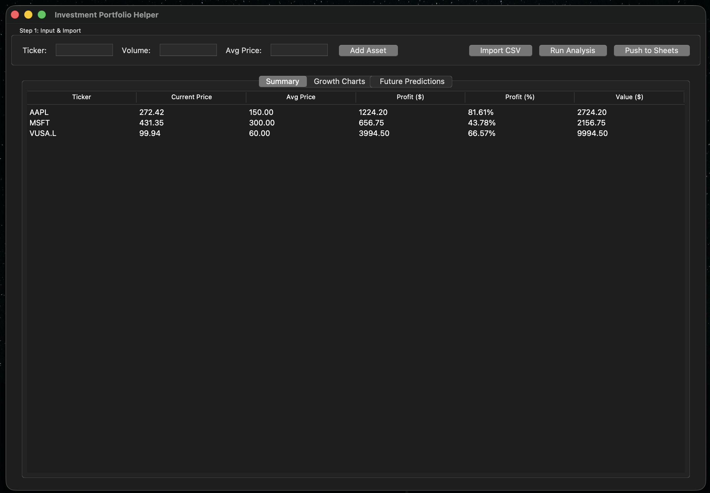
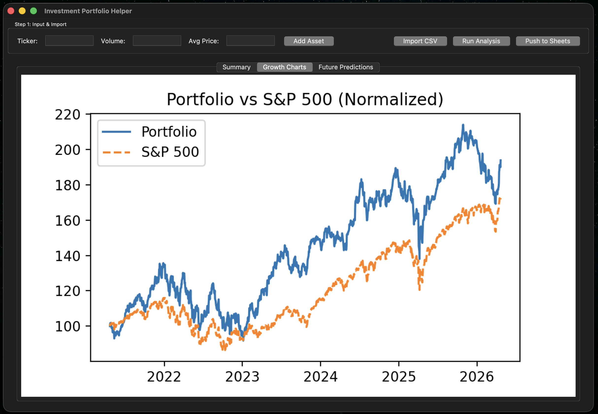
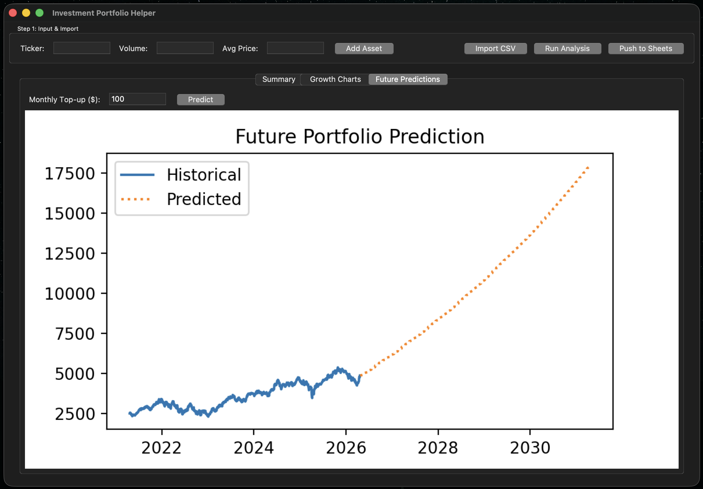

# 📈 Investment Portfolio Helper

A powerful Python-based dashboard to monitor your investment portfolio performance, compare against market benchmarks, and project future growth with realistic simulations.
---

## ✨ Key Features

### 🔍 Performance Analysis

- **Real-time Tracking**: Automatically fetches current market prices using the Yahoo Finance API (`yfinance`).
- **Detailed Metrics**: Calculates total valorization, percentage growth, and absolute dollar difference between average purchase price and current value.
- **Portfolio-wide Insights**: Analyzes the contribution of each individual asset to the overall strategy.

### 📊 Advanced Visualizations

- **Market Benchmarking**: Compare your normalized portfolio growth directly against the **S&P 500 (`^GSPC`)**.
- **Historical Trends**: Interactive charts showing the evolution of individual assets vs. the total portfolio value.
- **Future Projections**: Visualizes future growth based on historical **Compound Annual Growth Rate (CAGR)**.

### 🔮 Smart Predictions

- **Periodic Top-ups**: Simulate how monthly contributions will impact your portfolio value over the next 5+ years.
- **CAGR-based Modeling**: Uses long-term historical averages to provide realistic future performance estimates.

### 🖥️ Interactive GUI

- **User-friendly Interface**: Built with `Tkinter` for a clean, dual-panel experience.
- **Data Management**: Easily add assets manually or import them in bulk from a `.csv` file.
- **Control Center**: Adjust timeline views, prediction parameters, and chart types with simple buttons.

### ☁️ Cloud Integration

- **Google Sheets Push**: Export your latest portfolio summary directly to a Google Spreadsheet via the Sheets API for easy sharing and external tracking.

---

## 🚀 Getting Started

### 1. Installation

Ensure you have Python 3.x installed. Clone this repository and install the required dependencies:

```bash
pip install yfinance pandas matplotlib gspread google-auth-oauthlib google-auth-httplib2
```

> **Note for macOS Users:** If you encounter a `ModuleNotFoundError: No module named '_tkinter'`, install the Tkinter dependency via Homebrew:
> `brew install python-tk@3.x` (replace `3.x` with your Python version).

### 2. Running the Application

Launch the graphical dashboard:

```bash
python gui_app.py
```

### 3. CSV Import Format

To import your portfolio from a file, use a CSV with the following headers:
`ticker_symbol`, `share_volume`, `purchase_price`

Example `etfs.csv`:

```csv
ticker_symbol,share_volume,purchase_price
AAPL,10,150.0
MSFT,5,300.0
VUSA.L,100,60.0
```

---

## 🔐 Google Sheets Setup (Optional)

To use the **Push to Sheets** feature:

1. Enable the **Google Sheets & Drive APIs** in the [Google Cloud Console](https://console.cloud.google.com/).
2. Create a **Service Account**, download the `credentials.json` file, and place it in the project root.
3. Share your target Google Spreadsheet with the service account's email address.

---

## 🛠️ Project Structure

- `gui_app.py`: The main entry point for the graphical interface.
- `portfolio_logic.py`: Core engine for calculations, data fetching, and prediction models.
- `sheets_api.py`: Handles secure communication with the Google Sheets API.
- `etfs.csv`: Sample data file for quick testing.

---

## Screenshots






